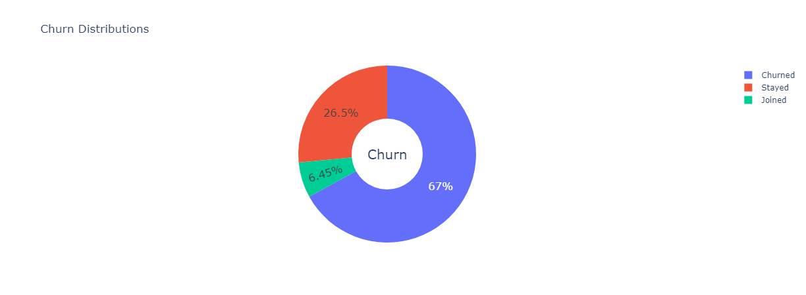
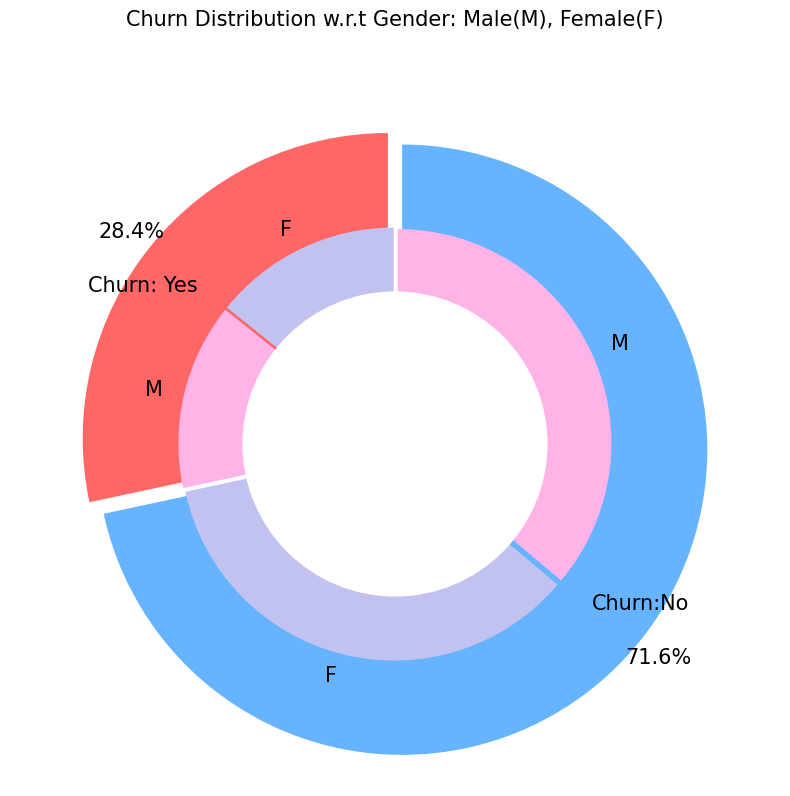
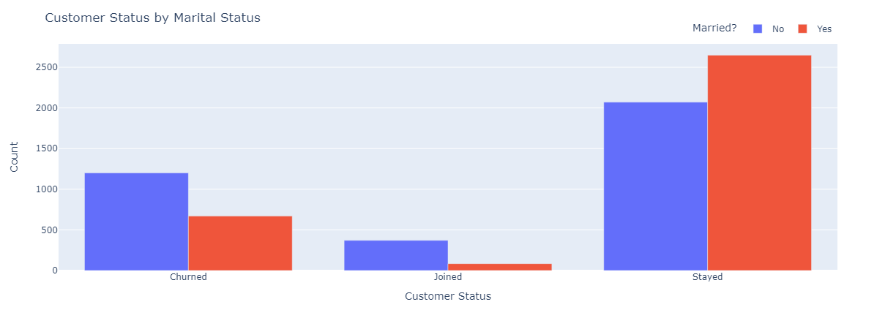
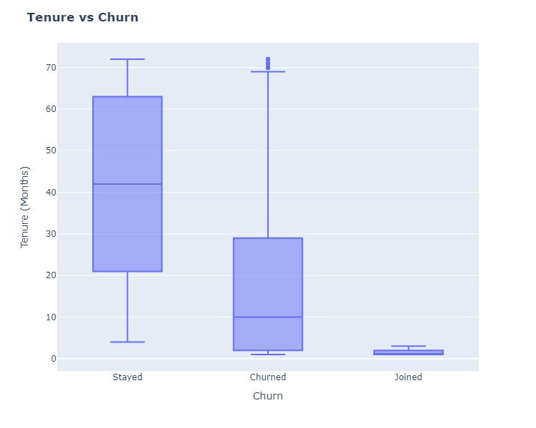

## Analytics
> There's a Power BI visualisation of the Descriptive Analysis I did, with a report in the Power BI service >>> [Customer Churn Analysis and Prediction 📊](https://app.powerbi.com/Redirect?action=openreport&context=Annotate&ctid=465ee04a-4213-467e-a5ca-54ddf5fdfac6&pbi_source=mobile_android&groupObjectId=ca5daaca-f884-453e-b0f3-629e0261bb47&appId=&reportObjectId=0d11ddc9-7bba-4088-a754-c717f976b7fa&reportPage=ReportSectiona649437dc1d83a982e60&bookmarkGuid=2ce8b340-d8a9-49d2-a4d8-08d700d0d870&fullScreen=0)

## Customer Churn Prediction


## 📌 Problem Definition
The `Customer Churn table` contains information on all `7,043` customers from a `Telecommunications company` in California in Q2 2022

Each record represents `one customer`, and contains details about their `demographics`, `location`, `tenure`, `subscription services`, `status for the quarter` `(joined, stayed, or churned)`, and more!

The `Zip Code Population` table contains complimentary information on the estimated populations for the California zip codes in the Customer Churn table

We need to `predict` whether the customer will `churn`, `stay` or `join` the company based on the parameters of the dataset.
<br><br>

## 👀 Screenshots







## 📓 Overview


| Machine Learning Models Applied            | Accuracy |
| ----------------- | ------------------------------------------------------------------ |
| Random Forest | 78.67% |
| Logistic Regression | 79.27% |
| Naive Bayes Gaussian | 37.44% |
| Decision Tree | 79.22% |
| XGB_Classifier | 82.18% |

<br>

## 👉 Application

The ability to predict churn before it happens allows businesses to take proactive actions to keep existing customers from churning. This could look like: 
```
  Customer success teams reaching out to those high-risk customers to provide support or to gauge 
  what needs may not be being met.
```

The advantage of calculating a company's churn rate is that it provides clarity on how well the business is retaining customers, which is a reflection on the quality of the service the business is providing, as well as its usefulness.

<br>

## ✍️ Authors

- [Agbai C Joshua](https://github.com/TheACJ)

<br>

## 🔗 Links


<a href='https://colab.research.google.com/drive/' target="_blank"></a>
<a href='https://www.kaggle.com/code/' target="_blank"></a>

[](https://choosealicense.com/licenses/mit/)

<br />

## 🪪 License
This project follows the [MIT LICENSE](https://choosealicense.com/licenses/mit/).

<br />

<div align="center">
<h3> Connect with me<a href="https://TheACJ.github.io"></a>
</h3> 
<p align="center">
    <a href="https://www.github.com/TheACJ" target="_blank" rel="noreferrer"></a> &nbsp&nbsp&nbsp
    <a href="https://www.linkedin.com/in/joshua_agbai" target="_blank"></a> &nbsp&nbsp&nbsp
    <a href="https://twitter.com/realacjoshua" target="_blank"></a> &nbsp&nbsp&nbsp
    <a href="https://www.instagram.com/realacjoshua" target="_blank"></a> &nbsp&nbsp&nbsp
    <a href="agbaijoshua@gmail.com" target="_blank"></a>&nbsp&nbsp&nbsp
<p align="right">(<a href="#top">Back to top</a>)</p>
</p> 
